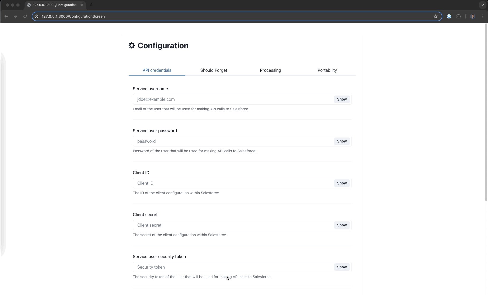
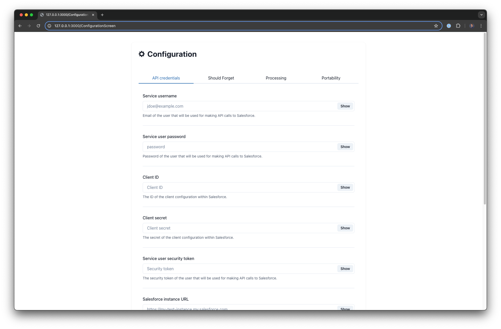
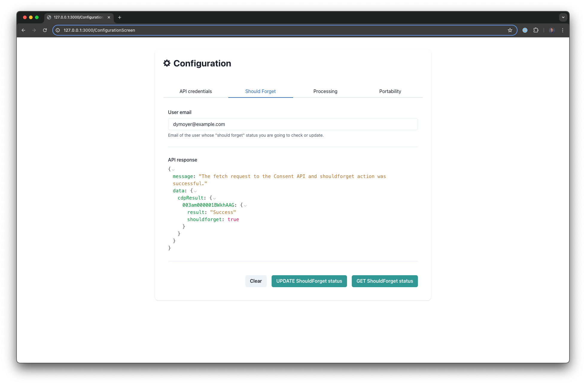
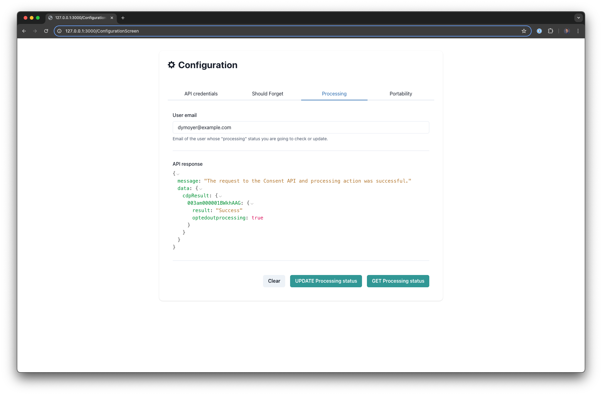
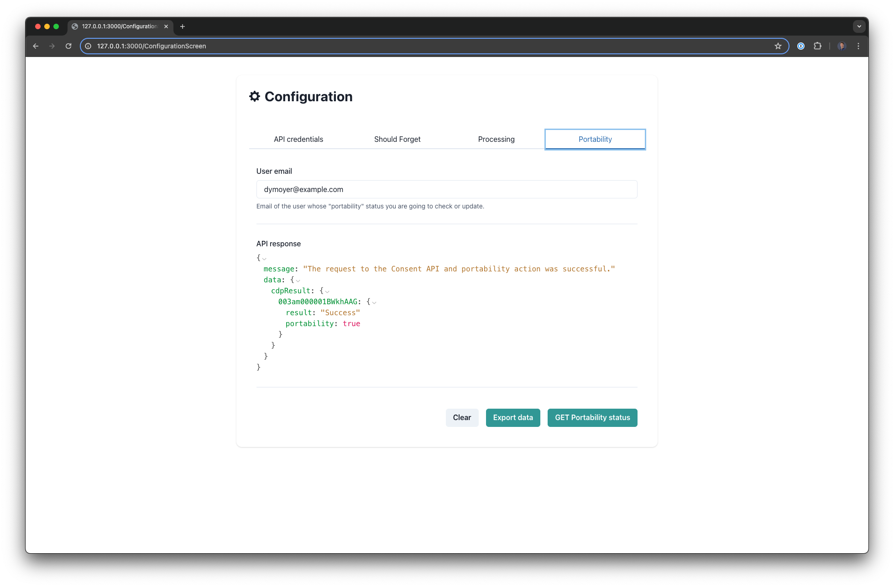

<a  href="https://www.salesforce.com/">

</a>

# Data Cloud and Consent API

This project is a simple node web server that is hosted on Heroku and it exposes the Salesforce Consent API for Data Cloud use cases. It also provides a small server side rendered user interface to update the API configuration.

# Table of Contents

- [Data Cloud and Consent API](#data-cloud-and-consent-api)
- [Table of Contents](#table-of-contents)
  - [What does it do?](#what-does-it-do)
  - [How does it work?](#how-does-it-work)
    - [Architecture diagram](#architecture-diagram)
  - [User Interface Demo](#user-interface-demo)
    - [API credentials](#api-credentials)
    - [Should Forget](#should-forget)
    - [Processing](#processing)
    - [Portability](#portability)
  - [Technologies used](#technologies-used)
- [Known Issues](#known-issues)
  - [Initial GET call](#initial-get-call)
  - [Should Forget cannot be undone](#should-forget-cannot-be-undone)
  - [API authentication](#api-authentication)
- [Personal notes](#personal-notes)
  - [Why did you chose Fastify?](#why-did-you-chose-fastify)
  - [Why Heroku?](#why-heroku)
  - [What's with Next and Fastify plugin?](#whats-with-next-and-fastify-plugin)
  - [Wait, can't you just use Postman for this?](#wait-cant-you-just-use-postman-for-this)
- [Configuration](#configuration)
  - [Requirements](#requirements)
  - [Setup](#setup)
    - [Development](#development)
    - [Deployment](#deployment)
      - [Can I deploy this anywhere else other than Heroku?](#can-i-deploy-this-anywhere-else-other-than-heroku)
  - [License](#license)
  - [Disclaimer](#disclaimer)

---

## What does it do?

The main functionality of this project is to expose the [Salesforce Consent API for Data Cloud](https://developer.salesforce.com/docs/atlas.en-us.api_rest.meta/api_rest/resources_consent_cdp_params.htm). The Consent API has 3 actions that offer different functionalities:

| Action       | Description                                                                                                                                 |
| ------------ | ------------------------------------------------------------------------------------------------------------------------------------------- |
| Processing   | This action is used to restrict processing of data in Data Cloud processes such as query and segmentation.                                  |
| Portability  | This action is used to allow export of Data Cloud profile data.                                                                             |
| Shouldforget | This action indicates the right to be forgotten, which means delete PII (Personally Identifiable Information) data and any related records. |

The web server offers the following endpoints:

| Endpoint                       | Method  | Description                                             |
| ------------------------------ | ------- | ------------------------------------------------------- |
| `/api/v1/processing/:id`       | `GET`   | Get the current processing status for a given email.    |
| `/api/v1/processing/:id`       | `PATCH` | Opt out of the processing for a given email.            |
| `/api/v1/portability/:id`      | `GET`   | Get the current portability status for a given email.   |
| `/api/v1/portability/:id`      | `PATCH` | Initiate data export for a given email.                 |
| `/api/v1/shouldForget/:id`     | `GET`   | Get the current should forget status for a given email. |
| `/api/v1/shouldForget/:id`     | `PATCH` | Initiate should forget action.                          |
| `/ConfigurationScreen`         | `GET`   | Get the UI for API interactions from the server.        |
| `/api/v1/configuration/update` | `POST`  | Update database API settings.                           |

Another functionality of this project is a user interface that gets server by the web server which provides a small React application to send requests to the above endpoints, see the JSON payload, and update API configurations.

## How does it work?

### Architecture diagram


This application is built with JavaScript, Node.js, and the Fastify framework. It provides several endpoints (see above) that interact with the Salesforce Consent API specifically for Data Cloud.

In addition to the API functionality, the project also provides a user interface that allows users to interact with the server. The user interface is built using React, Next, and Chakra UI. It allows users to send requests to the API endpoints, view the JSON payload, and update API configurations (see below for screenshots).

Whenever you make a request to one of the actions supported by the Consent API (`processing`, `portability`, and `shouldforget`), you need to include a user email address.

If you take a look at the above architecture diagram, this is the general request flow:

- send a request and provide an email address
- the server will check the Postgres database for `user_settings` table, but if no data exists, it will use the `.env` for API credentials
- with these credentials, it will send a request to Salesforce, specifically the `https://login.salesforce.com/services/oauth2/token` URL to get the authorization token
- once the token has been successfully retrieved, it will be used in the next request
- the next request is going to the Data Cloud query API together with an [SQL query](./src/utils/server/get-individual-id.js)
- this SQL query will search the Data Cloud Data Model Objects and find the individual ID based on the provided email address
- once the individual ID has been successfully retrieved, the next step is to call the Consent API with the proper action (`processing`, `portability`, and `shouldforget`)
- when checking the current status for a provided email address, a `GET` request is used
- when updating a status, a `PATCH` request is used
- one thing to point out is the `portability` action which exports the data to a custom S3 bucket
- the credentials for this bucket are retrieved from the `.env` file and these credentials need to be passed in the `PATCH` request
- once the request is passed off to Salesforce, the Salesforce system will export all the data pertaining to the email address from the Data Cloud Data Model Objects (DMOs) in a form o CSV files

## User Interface Demo



### API credentials



### Should Forget



### Processing



### Portability



## Technologies used

- [JavaScript](https://developer.mozilla.org/en-US/docs/Web/JavaScript)
- [Node.js](https://nodejs.org/en)
- [Fastify](https://fastify.dev/)
- [Fastify & Next.js](https://github.com/fastify/fastify-nextjs)
- [React](https://react.dev/)
- [Chakra](https://v2.chakra-ui.com/)
- [Heroku Postgres](https://elements.heroku.com/addons/heroku-postgresql)

For a more detailed overview of the development & production dependencies, please check `package.json`.

# Known Issues

## Initial GET call

If you look for a record within Data Cloud with the `GET` method and the record does not have a previous value configured for `shouldforget`, `processing`, or `portability`, the response will result in an error: `INVALID_ID_FIELD' as per [document](https://help.salesforce.com/s/articleView?id=000397169&type=1).

The solution for this is to make a `PATCH` request before `GET` and opt out by default. This is handled programmatically in this project and there is nothing for you to do.

## Should Forget cannot be undone

When you call the `shouhldforget` action and set the `status=optin`, you cannot change that value back to `optout`. Be careful when making opting in this action. Supporting documentation can be found [here](https://issues.salesforce.com/issue/a028c00000j5kYOAAY/cdp-consent-api-does-not-support-optout-statuses-for-shouldforget-action).

## API authentication

NOTE: There is NO authentication built here. Meaning, if you deploy this as is, anyone can hit your API without any authorization present.

# Personal notes

## Why did you chose Fastify?

I never used this framework, so this was a great opportunity for me to check it out.

## Why Heroku?

At the time of creating this project, I am a Salesforce employee. Since Salesforce owns Heroku, this was the "official" way of building a proof of concept.

## What's with Next and Fastify plugin?

Yeah... Not my brightest moment. I started building out the server with fastify and at the very end, there was a "need" to have a small UI. I saw the fastify and next.js plugin and decided to add it in. If I was doing the whole project again, I would not include a whole next library for this.

## Wait, can't you just use Postman for this?

Of course you can. The idea behind this project is to try something new. Don't forget, this is just a proof of concept, not a production level application.

# Configuration

## Requirements

To run this application locally and successfully interact with the Consent API for Data Cloud, you will need the following:

- An active Salesforce account with Data Cloud provisioned
- Node.js version 20 or later installed (type `node -v` in your terminal to check). Follow [instructions](https://nodejs.org/en/download) if you don't have node installed
- npm version 10.0.0 or later installed (type `npm -v` in your terminal to check). Node.js includes `npm`
- git installed. Follow the instructions to [install git](https://git-scm.com/downloads)
- A [Heroku account](https://signup.heroku.com/)
- A Heroku [Postgres addon](https://elements.heroku.com/addons/heroku-postgresql)
- An [AWS account](https://aws.amazon.com/), specifically an S3 bucket (this is only needed if you want to export the data, otherwise, you can skip this step and the `portability` action will not work for you)

## Setup

The first step is to clone the repository and install the project dependencies via a terminal interface by running the `npm install` in the proper folder:

```
cd salesforce-data-cloud-consent-api
npm install
```

The second step is to create a `.env` file in the root of the project by copying `.env.example` file.

```
cp .env.example .env
```

Edit the newly created `.env` file and update the variables with your account specific information:

```
# Application settings
PORT=

# Salesforce credentials
SERVICE_USER_USERNAME=
SERVICE_USER_PASSWORD=
CLIENT_ID=
CLIENT_SECRET=
SERVICE_USER_SECURITY_TOKEN=
SALESFORCE_LOGIN_URL=
SALESFORCE_INSTANCE_URL=
SALESFORCE_API_VERSION=
UNIFIED_INDIVIDUAL_DMO_API_NAME=
UNIFIED_CONTACT_POINT_EMAIL_DMO_API_NAME=

# AWS credentials
AWS_S3_BUCKET_ID=
AWS_ACCESS_KEY_ID=
AWS_SECRET_ACCESS_KEY=
AWS_S3_FOLDER=
AWS_REGION=

#Database credentials
DATABASE_USER=
DATABASE_PASSWORD=
DATABASE_HOST=
DATABASE_PORT=
DATABASE_NAME=
```

NOTE: If you want to deploy this application to Heroku, you will have to create all of the above variables as Heroku environment variables. This can be done via the [command line or the Heroku Dashboard UI](https://devcenter.heroku.com/articles/config-vars).

Once all of this is done, you are ready to run the application locally!

### Development

To run the application locally, use the command line, navigate to the folder, ensure the dependencies are installed properly, and run the following:

```
cd salesforce-data-cloud-consent-api
npm run dev
```

This will automatically run the Fastify development server. Your app will run on `http://127.0.0.1:3000`. The user interface will be available at `http://127.0.0.1:3000/ConfigurationScreen`.

When you make changes to your code, the server will automatically restart to fetch new changes.

### Deployment

Once you are happy with your application, you can deploy it to Heroku!

To deploy the application to Heroku, please follow the [official instructions](https://devcenter.heroku.com/articles/git).

#### Can I deploy this anywhere else other than Heroku?

Absolutely! The only reason why Heroku is used here is because it is owned by Salesforce and at the moment of creating this I am a Salesforce employee. Nothing in this project is specific to Heroku except for the [Procfile](/Procfile) which you can delete or ignore if you are using a different hosting provider.

## License

[MIT](http://www.opensource.org/licenses/mit-license.html)

## Disclaimer

This software is to be considered "sample code", a Type B Deliverable, and is delivered "as-is" to the user. Salesforce bears no responsibility to support the use or implementation of this software.
